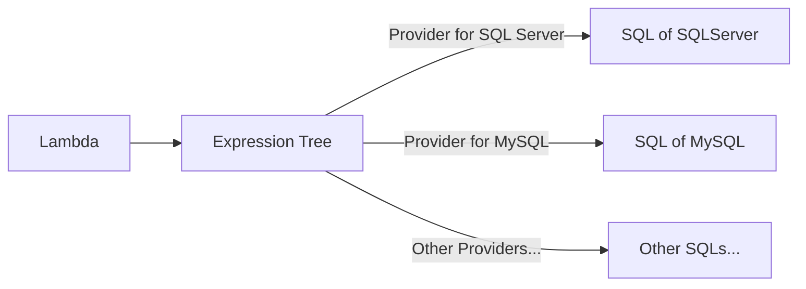
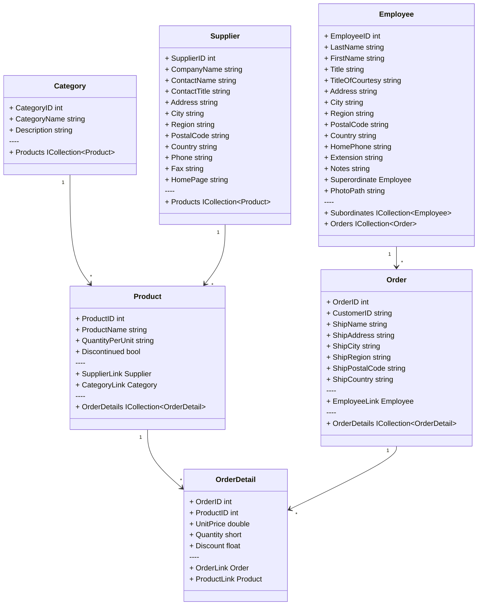

# Getting started

### Expoloer LinqSharp

Exploring **LinqSharp** requires a clear understanding of the **SQL** statements it generates.

<br/>

#### Expression trees

**Expression trees** established **C#** as a truly formidable language.

We can easily convert **Lambda** into **Expression Tree** via the **LINQ** API, while **.NET** allows us to convert **Expression Tree** into any form we want.



Most languages do not provide compile-time conversion of Lambdas to Expression Trees, which is one of the reasons why the .NET ORM can be designed to be very easy to use.

It is worth pointing out that true generics support is also indispensable, which makes the expression tree more scalable.

<br/>

#### Print SQL

If you don't have a test database available, try **Northwnd**.

With this simple sales network database, we'll show you how to use **LinqSharp**.



1. Create a Console Application ( **.NET 7** ).

2. Use the follow command to install **Northwnd**:

    ```powershel copy
    dotnet add package Microsoft.EntityFrameworkCore --version 7.0.0
    dotnet add package Microsoft.EntityFrameworkCore.Design --version 7.0.0
    dotnet add package Microsoft.EntityFrameworkCore.Sqlite --version 7.0.0
    dotnet add package LinqSharp --version 7.0
    dotnet add package Northwnd --version 7.0
    dotnet add package Ink --version 0.12.1
    ```

3. Then, you need to add a `NorthwndFactory.cs` file in the root of your project:

    ```csharp copy filename="NorthwndFactory.cs"
    public class NorthwndFactory : IDesignTimeDbContextFactory<NorthwndContext>
    {
        private static readonly string _connectionString = "Data Source=northwnd.db";
    
        public NorthwndContext CreateDbContext(params string[] args)
        {
            var assemblyName = Assembly.GetExecutingAssembly().GetName().Name;
            var options = new DbContextOptionsBuilder()
                .UseSqlite(_connectionString, x => x.MigrationsAssembly(assemblyName))
                .Options;
            return new NorthwndContext(options);
        }
    }
    ```

4. Open a terminal, execute the follow script to generate a migration, and update it to database:

    ```powershell copy
    dotnet ef migrations add InitNorthwnd
    ```

5. Edit the `Program.cs` file:

    ```csharp copy filename="Program.cs"
    static void Main(string[] args)
    {
        var factory = new NorthwndFactory();
        using var context = factory.CreateDbContext();
    
        if (!context.Database.GetAppliedMigrations().Any())
        {
            context.Database.Migrate();
            context.InitializeNorthwnd(new NorthwndMemoryContext());
        }
    
        var query = (
            from c in context.Categories
            select new
            {
                c.CategoryID,
                c.CategoryName,
            }
        );
        var sql = query.ToQueryString();
    
        Echo.Line(sql)
            .Table(query);
    }
    ```

6. Compile and run the application, if all already done, you will get the output:

    ```sql
    SELECT "c"."CategoryID", "c"."CategoryName"
    FROM "Categories" AS "c"
    ```
    ```markdown
    +------------+----------------+
    | CategoryID | CategoryName   |
    +------------+----------------+
    | 1          | Beverages      |
    | 2          | Condiments     |
    | 3          | Confections    |
    | 4          | Dairy Products |
    | 5          | Grains/Cereals |
    | 6          | Meat/Poultry   |
    | 7          | Produce        |
    | 8          | Seafood        |
    +------------+----------------+
    ```

<br/>
