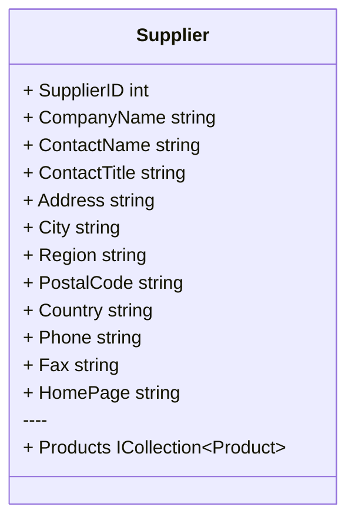
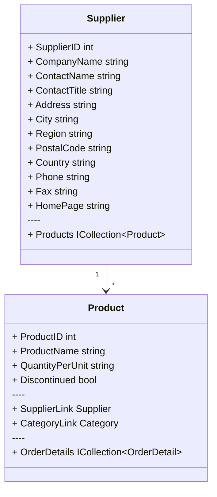

### Search

**Search extension** provides support for searching the entire database for a specified value.

<br/>

In the sample database, the records in the **Suppliers** table are as follows:



Now, we query for records containing `ch` in the **`ContactName`** or **`CompanyName`** column in the **Suppliers** table:

```csharp
var query = (
    from s in context.Suppliers.Search("ch", s => new
    {
        s.ContactName,
        s.CompanyName,
    })
    select new
    {
        s.SupplierID,
        s.ContactName,
        s.CompanyName,
    }
);

Echo.Line(query.ToQueryString())
    .Table(query);
```

The output is:

```sql
SELECT "s"."SupplierID", "s"."ContactName", "s"."CompanyName"
FROM "Suppliers" AS "s"
WHERE 
(
    ("s"."ContactName" IS NOT NULL)
    AND ('ch' = '' OR instr("s"."ContactName", 'ch') > 0)
) 
OR 'ch' = '' OR instr("s"."CompanyName", 'ch') > 0
```

```markdown
+------------+---------------+----------------------------------------+
| SupplierID | ContactName   | CompanyName                            |
+------------+---------------+----------------------------------------+
| 13         | Sven Petersen | Nord-Ost-Fisch Handelsgesellschaft mbH |
| 17         | Michael Bj?rn | Svensk Sj?f?da AB                      |
| 19         | Robb Merchant | New England Seafood Cannery            |
| 22         | Dirk Luchte   | Zaanse Snoepfabriek                    |
+------------+---------------+----------------------------------------+
```

<br/>

Things are starting to get interesting.

If you want to search in a related table, you only need a little modification.

For example, we query the records containing `ch` in the **`CompanyName`** column in the **Suppliers** table and the **`ProductName`** of its associated table **Products**:



```csharp
var query = (
    from s in context.Suppliers.Search("ch", s => new
    {
        s.CompanyName,
        _ = from p in s.Products select p.ProductName,
    })
    select new
    {
        s.SupplierID,
        s.CompanyName,
        Products = string.Join(",",
            from p in s.Products
            select p.ProductName
        ),
    }
);

Echo.Line(query.ToQueryString())
    .Table(query);
```

```sql
SELECT "s"."SupplierID", "s"."CompanyName", "p0"."ProductName", "p0"."ProductID"
FROM "Suppliers" AS "s"
LEFT JOIN "Products" AS "p0" ON "s"."SupplierID" = "p0"."SupplierID"
WHERE 'ch' = '' OR instr("s"."CompanyName", 'ch') > 0 OR EXISTS (
    SELECT 1
    FROM "Products" AS "p"
    WHERE "s"."SupplierID" = "p"."SupplierID" AND ('ch' = '' OR instr("p"."ProductName", 'ch') > 0))
ORDER BY "s"."SupplierID"
```

```markdown
+------------+----------------------------------------+----------------------------------------------------------------+
| SupplierID | CompanyName                            | Products                                                       |
+------------+----------------------------------------+----------------------------------------------------------------+
| 5          | Cooperativa de Quesos 'Las Cabras'     | Queso Cabrales,Queso Manchego La Pastora                       |
| 11         | Heli Sü?waren GmbH & Co. KG            | NuNuCa Nu?-Nougat-Creme,Gumb?r Gummib?rchen,Schoggi Schokolade |
| 13         | Nord-Ost-Fisch Handelsgesellschaft mbH | Nord-Ost Matjeshering                                          |
| 16         | Bigfoot Breweries                      | Sasquatch Ale,Steeleye Stout,Laughing Lumberjack Lager         |
| 25         | Ma Maison                              | Tourtière,Paté chinois                                         |
| 26         | Pasta Buttini s.r.l.                   | Gnocchi di nonna Alice,Ravioli Angelo                          |
+------------+----------------------------------------+----------------------------------------------------------------+
```


<br/>

The **Search** extension provides the following search methods:

|         | Option          | Description                                                  |
| ------- | --------------- | ------------------------------------------------------------ |
| default | **Contains**    | Any specified field **contains** the search string.          |
|         | **NotContains** | The search string is **not included** in any of the specified fields. |
|         | **Equals**      | Any specified field **equals** the search string.            |
|         | **NotEquals**   | **None** of the specified fields are **equal** to the search string. |

